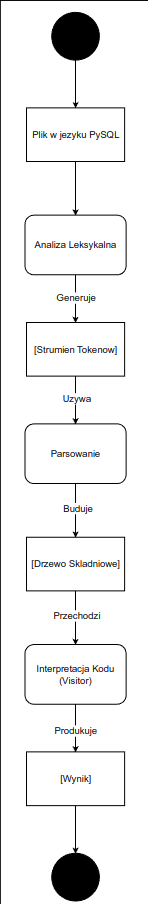
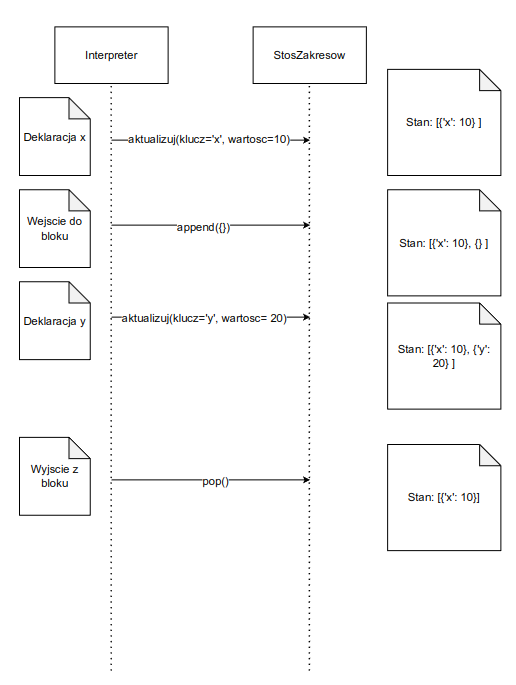

## Raport z Implementacji Interpretera Języka PySQL
### 1. Wprowadzenie

Niniejszy dokument stanowi raport techniczny opisujący architekturę i implementację interpretera dla języka PySQL. Język ten, zdefiniowany w gramatyce ANTLR (PySQL.g4), łączy w sobie paradygmaty programowania imperatywnego (zmienne, pętle, funkcje) z elementami zapytań deklaratywnych w stylu SQL.

Raport szczegółowo omawia kluczowe decyzje projektowe i mechanizmy implementacyjne, opierając się na kodzie PySQLInterpreter.py. Główny nacisk położono na następujące zagadnienia:

- Architektura i liczba przebiegów interpretera.

- Sposób implementacji tablicy symboli.

- Realizacja rekordów aktywacji (ramek stosu) dla wywołań funkcji.

- Implementacja istotnych funkcjonalności języka, takich jak system typów, obsługa zakresów, instrukcja SELECT itd.

### 2. Architektura Interpretera i Użycie ANTLR

Implementacja opiera się na narzędziu ANTLR, które na podstawie pliku gramatyki PySQL.g4 generuje kod w Pythonie. Ten kod składa się z:

- Leksera (PySQLLexer): Odpowiedzialnego za podział kodu źródłowego na strumień tokenów (słowa kluczowe, identyfikatory, operatory, literały).

- Parsera (PySQLParser): Budującego z tokenów drzewo składniowe (Parse Tree), które reprezentuje strukturę gramatyczną programu.

- Visitera (PySQLVisitor): Bazowego interfejsu, który zaimplementowano w klasie PySQLInterpreter do przechodzenia po drzewie składniowym.

```Python
def run_interpreter(input_code, base_dir=""):
    # 1. Tworzenie leksera z kodu wejściowego
    lexer = PySQLLexer(InputStream(input_code))
    lexer.removeErrorListeners()
    lexer.addErrorListener(PySQLErrorListener())

    # 2. Tworzenie strumienia tokenów z leksera
    stream = CommonTokenStream(lexer)
    
    # 3. Tworzenie parsera ze strumienia tokenów
    parser = PySQLParser(stream)
    parser.removeErrorListeners()
    parser.addErrorListener(PySQLErrorListener())

    try:
        # 4. Parsowanie kodu i budowa drzewa składniowego
        tree = parser.prog()
        
        # 5. Tworzenie instancji interpretera (Visitor)
        interpreter = PySQLInterpreter(base_dir)
        
        # 6. Uruchomienie interpretera na drzewie składniowym
        interpreter.visit(tree)
    except PySQLException as e:
        print(e)
    except Exception as e:
        print(f"An unexpected error occurred: {e}")
```

#### 2.1. Liczba i Cel Przebiegów

Architektura interpretera opiera się na jednym głównym przebiegu. Proces przetwarzania kodu wygląda następująco:

- Przebieg ANTLR (Parsowanie): Narzędzie ANTLR wykonuje jeden przebieg przez kod źródłowy, aby zbudować kompletne drzewo składniowe. Na tym etapie wykrywane są błędy składniowe (np. brakujący nawias, nieoczekiwane słowo kluczowe), co jest obsługiwane przez dedykowaną klasę PySQLErrorListener.

- Przebieg Interpretera (Wykonanie): Po pomyślnym zbudowaniu drzewa, interpreter (PySQLInterpreter) wykonuje jeden przebieg (jedno przejście) po tym drzewie, używając wzorca projektowego Visitor. Odwiedzając poszczególne węzły drzewa (reprezentujące instrukcje, wyrażenia, deklaracje), interpreter wykonuje odpowiadające im akcje semantyczne – oblicza wartości, modyfikuje stan, wywołuje funkcje.

Podsumowując, jest to model jednoprzebiegowego interpretera przechodzącego po drzewie składniowym. Poniższy kod ilustruje, jak podczas tego jednego przebiegu obsługiwane są definicje funkcji – są one rejestrowane, a nie wykonywane, co pozwala na ich późniejsze wywołanie.
```Python
def visitProg(self, ctx):
    # Główna pętla interpretera - przechodzi po wszystkich instrukcjach
    for child in ctx.stat():
        self.visit(child)

def visitFuncDef(self, ctx: PySQLParser.FuncDefContext):
    # Metoda wywoływana, gdy Visitor napotka definicję funkcji
    fname = ctx.identifierName().ID().getText()
    # ... (pobieranie parametrów i typu zwrotnego) ...

    # Definicja funkcji (jej parametry, typ i ciało)
    # jest zapisywana w globalnej strukturze `self.functions`.
    # Ciało funkcji (body_stmts) nie jest w tym momencie wykonywane.
    body_stmts = ctx.stat() 
    self.functions[fname] = (params, ret_type, body_stmts)
    return None # Zakończenie wizyty w tym węźle
```

### 3. Kluczowe Zagadnienia Implementacyjne
#### 3.1. Sposób Implementacji Tablicy Symboli

Tablica symboli, czyli struktura przechowująca informacje o identyfikatorach (zmiennych, funkcjach) w programie, została zaimplementowana w elastyczny sposób, pozwalający na obsługę zagnieżdżonych zakresów. Podstawą implementacji są trzy struktury danych inicjalizowane w konstruktorze interpretera.
```Python
class PySQLInterpreter(PySQLVisitor):
    def __init__(self, base_dir="", shared_import_context=None):
        # Stos zakresów dla wartości zmiennych. Zawsze zawiera co najmniej zakres globalny.
        self.scopes = [{}]
        # Równoległy stos dla typów zmiennych.
        self.var_types = [{}]
        # Globalna, płaska tablica symboli dla funkcji (wbudowanych i zdefiniowanych).
        self.functions = {
            'toUpper': (..., self.builtin_toUpper),
            # ... inne funkcje wbudowane ...
        }
        # ... reszta inicjalizacji ...
```
- self.scopes = [{}]: Jest to stos zakresów dla wartości zmiennych. Został zaimplementowany jako lista (działająca jak stos) zawierająca słowniki. Każdy słownik reprezentuje jeden poziom zakresu (scope). Na dnie stosu (indeks 0) znajduje się zawsze zakres globalny.

- self.var_types = [{}]: Działa analogicznie do self.scopes, ale przechowuje informacje o typach zmiennych oraz o linii, w której zmienna została zadeklarowana.

- self.functions = {}: Jest to globalna, płaska tablica symboli dla funkcji. Przechowuje definicje wszystkich funkcji (wbudowanych i zdefiniowanych przez użytkownika).

**Zarządzanie zakresem:**
Cykl życia zakresów (a co za tym idzie, zmiennych lokalnych) jest zarządzany przez metody visit, które obsługują bloki kodu.

- Wejście do nowego zakresu: Metoda visitBlock (wywoływana dla każdego bloku {...}) jest doskonałym przykładem. Na początku dodaje nowy, pusty słownik na wierzch stosów self.scopes i self.var_types, tworząc nowy, lokalny zakres.

- Wyjście z zakresu: Po wykonaniu wszystkich instrukcji w bloku, sekcja finally gwarantuje, że ostatni zakres jest usuwany ze stosów (pop()), niszcząc tym samym wszystkie zadeklarowane w nim zmienne.
```Python
def visitBlock(self, ctx: PySQLParser.BlockContext):
    # Wejście do nowego zakresu
    self.scopes.append({})
    self.var_types.append({})
    
    try:
        # Wykonanie instrukcji w nowym, lokalnym zakresie
        for stmt in ctx.stat():
            self.visit(stmt)
    finally:
        # Wyjście z zakresu i zniszczenie zmiennych lokalnych
        self.scopes.pop()
        self.var_types.pop()
    
    return None
```
- Wyszukiwanie zmiennej: Metoda _find_variable_scope implementuje kluczową logikę leksykalnego zasięgu. Przeszukuje ona stos zakresów od góry (bieżący, najbardziej wewnętrzny zakres) do dołu (zakres globalny). Pierwsza znaleziona zmienna o danej nazwie jest zwracana.
```Python
def _find_variable_scope(self, var_name):
    """Przeszukuje stos zakresów od końca w poszukiwaniu zmiennej."""
    for scope in reversed(self.scopes):
        if var_name in scope:
            return scope
    return None
```

#### 3.2. Sposób Implementacji Rekordów Aktywacji (Ramek Stosu)

Koncepcja rekordów aktywacji jest w naszej implementacji realizowana poprzez dynamiczne zarządzanie stosem zakresów (self.scopes) w połączeniu z mechanizmem wyjątków. Ramka stosu w PySQL jest zbiorem mechanizmów, które razem zapewniają poprawne działanie wywołań funkcji, w tym rekurencji.

Poniżej omówiono poszczególne elementy składowe rekordu aktywacji i ich implementację.
**Parametry i Zmienne Lokalne**

Jest to podstawowa funkcja ramki stosu – przechowywanie danych lokalnych dla danego wywołania. W naszym interpreterze jest to realizowane przez dodanie nowego słownika na szczyt stosu self.scopes przy wywołaniu funkcji. Ten nowy słownik staje się aktywnym zakresem dla parametrów i zmiennych lokalnych.
```Python
# Fragment z visitFactor, odpowiedzialny za wywołanie funkcji
elif ctx.identifierName() and ctx.getChildCount() > 1 and ctx.getChild(1).getText() == '(':
    # ...
    if not callable(implementation):
        # 1. UTWORZENIE RAMKI STOSU (Rekordu Aktywacji)
        function_scope = {'__is_function_scope': True}
        self.scopes.append(function_scope)
        self.var_types.append({})

        # 2. PRZEKAZANIE ARGUMENTÓW do nowej ramki
        for i, ((pname, ptype), val) in enumerate(zip(params, processed_args)):
            self.scopes[-1][pname] = val
            self.var_types[-1][pname] = (ptype, ctx.start.line)
        # ...
```
**Obsługa Wartości Zwracanej**

Zamiast rezerwować dedykowane miejsce w ramce stosu, nasz interpreter wykorzystuje mechanizm wyjątków do "transportu" wartości zwracanej z funkcji do miejsca jej wywołania. Gdy napotkana zostaje instrukcja return, rzucany jest specjalny wyjątek ReturnException, który przenosi wartość i natychmiastowo przerywa wykonywanie ciała funkcji.
```Python
# Definicja wyjątku do przenoszenia wartości
class ReturnException(Exception):
    def __init__(self, value):
        self.value = value

# Metoda obsługująca instrukcję `return`
def visitReturnStat(self, ctx):
    val = self.visit(ctx.expr()) if ctx.expr() else None
    raise ReturnException(val)
```
Wyjątek ten jest przechwytywany w miejscu wywołania funkcji, co pozwala na odczytanie zwróconej wartości.
```Python
# Fragment z visitFactor
try:
    # 3. WYKONANIE CIAŁA FUNKCJI
    for stmt_ctx in body_stmts:
        self.visit(stmt_ctx)
except ReturnException as r:
    # 4. OBSŁUGA POWROTU
    result = r.value
```
**Adres Powrotu, Dowiązanie Dynamiczne i Statyczne**
Te elementy są obsługiwane przez architekturę interpretera:

- **Adres Powrotu**: Jest obsługiwany niejawnie przez wzorzec Visitor i stos wywołań Pythona. Po zakończeniu metody visitFactor, sterowanie naturalnie powraca do miejsca w kodzie, które ją wywołało, kontynuując przetwarzanie drzewa składniowego.

- **Dowiązanie Dynamiczne** (Dynamic Link): Stos self.scopes sam w sobie pełni rolę stosu dowiązań dynamicznych. 

- **Dowiązanie Statyczne** (Static/Lexical Link): Jest to wskaźnik do leksykalnie nadrzędnego zakresu. W naszym języku jest on realizowany jawnie za pomocą słowa kluczowego parent::.
```Python
def visitIdentifierName(self, ctx: PySQLParser.IdentifierNameContext):
    var_name = ctx.ID().getText() 
    levels = len(ctx.parentAccess())

    if levels > 0:
        # Sprawdź, czy BIEŻĄCY zakres jest zakresem funkcyjnym.
        is_current_scope_function = self.scopes[-1].get('__is_function_scope', False)
        
        if is_current_scope_function:
            # --- LOGIKA DLA FUNKCJI ---
            # `parent::` rozpoczyna wyszukiwanie od zakresu nadrzędnego i kontynuuje w górę.
            if levels > 1:
                raise PySQLNameError(f"Cannot use nested 'parent::' ({levels} levels) inside a function.", line=ctx.start.line)
            # ... wyszukiwanie w zakresie globalnym ...
        else:
            # --- LOGIKA DLA ZWYKŁYCH BLOKÓW (`{...}`) ---
            # `parent::` rozpoczyna wyszukiwanie od zakresu nadrzędnego i kontynuuje w górę.
            start_index = -1 - levels
            if abs(start_index) > len(self.scopes):
                raise PySQLNameError(f"Parent scope access out of bounds for {'parent::'*levels}x", line=ctx.start.line)
            
            positive_start_index = len(self.scopes) + start_index
            for i in range(positive_start_index, -1, -1):
                # ... wyszukiwanie w pętli w górę stosu ...
    else:
        # Standardowe wyszukiwanie (bez `parent::`)
        scope = self._find_variable_scope(var_name)
        # ...
```
**Wsparcie dla Rekurencji**
Dzięki temu, że każde wywołanie funkcji (nawet tej samej) tworzy na stosie całkowicie nową, niezależną ramkę aktywacji, nasza implementacja w pełni i poprawnie obsługuje rekurencję. Każde wywołanie rekurencyjne ma swój własny zestaw zmiennych lokalnych, a stos self.scopes rośnie i kurczy się w rytm wywołań i powrotów, zapewniając, że dane z poszczególnych poziomów rekurencji nie kolidują ze sobą.


### 4. Implementacja Istotnych Funkcjonalności
#### 4.1. System Typów i Rzutowanie

Język PySQL posiada system typów z deklaracjami i sprawdzaniem w czasie wykonania. Oznacza to, że typy są znane i weryfikowane podczas działania programu.
**Jawna Deklaracja i Sprawdzanie Typów**

Podstawą systemu jest jawna deklaracja typu przy tworzeniu zmiennej. Metoda visitVarDecl jest odpowiedzialna za sprawdzenie, czy typ wartości inicjującej zgadza się z zadeklarowanym typem.
```Python
def visitVarDecl(self, ctx):
    # ... (pobieranie nazwy i typu zmiennej) ...
    value = self.visit(ctx.expr()) if ctx.expr() else None
    declared_type = ctx.varType().getText()

    if value is not None:
        inferred_type = self.infer_type(value)

        # ... (obsługa automatycznej konwersji dla float i array<float>) ...

        if not self.type_matches(declared_type, inferred_type):
            raise Exception(f"Type mismatch in declaration of '{var_name}'... ")

    # Zapisanie zmiennej i jej typu do odpowiednich zakresów
    self.scopes[-1][var_name] = value
    self.var_types[-1][var_name] = (declared_type, line)
    return value
```
Sercem mechanizmu są metody pomocnicze infer_type oraz type_matches, które definiują logikę systemu typów.
```Python
def infer_type(self, value):
    if isinstance(value, list):
        if not value:
            return 'array<mixed>'
        # ... logika inferencji dla tablic ...
    if isinstance(value, bool): return 'bool'
    if isinstance(value, int): return 'int'
    if isinstance(value, float): return 'float'
    if isinstance(value, str): return 'string'
    return 'unknown'

def type_matches(self, declared, actual):
    if declared == actual:
        return True
    # Umożliwia przypisanie int do float
    if declared == 'float' and actual == 'int':
        return True
    if declared == 'mixed' or actual == 'mixed':
        return True
    # ... logika dopasowania dla tablic ...
    return False
```

**Niejawna Deklaracja przez Przypisanie**
Oprócz jawnej deklaracji z typem, język PySQL oferuje również elastyczność w postaci niejawnej deklaracji zmiennej poprzez pierwsze użycie w instrukcji przypisania. Gdy interpreter napotyka przypisanie do zmiennej, która nie została wcześniej zadeklarowana, zamiast zgłaszać błąd, tworzy ją w bieżącym zakresie. Typ nowej zmiennej jest automatycznie wywnioskowany (infer_type) na podstawie typu przypisanej wartości. Za tę logikę odpowiada metoda visitAssign.
```Python
# Fragment z visitAssign
def visitAssign(self, ctx: PySQLParser.AssignContext):
    value = self.visit(ctx.expr())
    # ...
    # Przypisanie do zmiennej
    var_name = ctx.identifierName().ID().getText()
    
    # Próba znalezienia istniejącej zmiennej
    target_scope = self._find_variable_scope(var_name)
    
    if target_scope is None:
        # Zmienna nie istnieje, tworzymy ją w BIEŻĄCYM zakresie
        target_scope = self.scopes[-1]
        target_types_scope = self.var_types[-1]
        # Zapisanie nowego typu (wywnioskowanego)
        value_type = self.infer_type(value)
        target_types_scope[var_name] = (value_type, ctx.start.line)
    else:
        # Zmienna istnieje, sprawdzamy zgodność typów
        # ...
    
    target_scope[var_name] = value
    return value
```

**Rzutowanie**
Język umożliwia jawną konwersję typów za pomocą składni (typ)wyrażenie. Logika ta jest zaimplementowana w metodzie visitFactor, która obsługuje różne przypadki konwersji.
```Python
# Fragment z metody visitFactor odpowiedzialny za rzutowanie
if ctx.getChildCount() == 4 and \
   ctx.getChild(0).getText() == '(' and \
   isinstance(ctx.getChild(1), PySQLParser.VarTypeContext) and \
   ctx.getChild(2).getText() == ')':
    target_type_str = ctx.varType().getText()
    value_to_cast = self.visit(ctx.factor()) 

    if target_type_str == 'int':
        if isinstance(value_to_cast, float): return int(value_to_cast)
        # ... inne reguły rzutowania na int ...
    
    elif target_type_str == 'float':
        if isinstance(value_to_cast, int): return float(value_to_cast)
        # ... inne reguły rzutowania na float ...

    # ... obsługa rzutowania na bool i string ...
```

**Obsługa Typów Tablicowych**
System typów rozciąga się również na tablice, obsługując zarówno tablice o jednolitym typie (np. array<int>) jak i tablice mieszane (array<mixed>). Mechanizm ten opiera się na kilku kluczowych metodach:

- Tworzenie tablicy: Metoda visitArrayLiteral jest odpowiedzialna za przetworzenie literału tablicowego (np. [1, "a", true]) na listę Pythona. Rekurencyjnie odwiedza ona każde wyrażenie wewnątrz nawiasów kwadratowych.
```Python
def visitArrayLiteral(self, ctx):
    elements = [self.visit(expr) for expr in ctx.expr()] if ctx.expr() else []
    return elements
```

- Dostęp do elementów: Metoda visitArrayIndex obsługuje dostęp do elementu tablicy poprzez indeks (np. myArray[0]). Wykonuje ona kluczowe walidacje w czasie wykonania: sprawdza, czy zmienna jest rzeczywiście tablicą, czy indeks jest liczbą całkowitą i czy mieści się w granicach tablicy.

```Python
def visitArrayIndex(self, ctx: PySQLParser.ArrayIndexContext):
    index_val = self.visit(ctx.expr())
    arr = self.visit(ctx.identifierName())
    # ...
    if not isinstance(arr, list):
        raise PySQLTypeError(...)
    if not isinstance(index_val, int):
        raise PySQLTypeError(...)
    if not 0 <= index_val < len(arr):
        raise PySQLValueError(...)

    return arr, index_val
```


#### 4.2. Zarządzanie Zakresem i parent::

Oprócz standardowego, leksykalnego zasięgu zmiennych, język wprowadza słowo kluczowe parent:: do jawnego odwoływania się do zakresów nadrzędnych. Służy ono jako narzędzie do nawigacji po łańcuchu statycznym (leksykalnym), umożliwiając dostęp do przesłoniętych zmiennych. Implementacja tego mechanizmu znajduje się w metodzie visitIdentifierName.

```Python
def visitIdentifierName(self, ctx: PySQLParser.IdentifierNameContext):
    var_name = ctx.ID().getText() 
    levels = len(ctx.parentAccess())

    if levels > 0:
        # ...
            # Wewnątrz zagnieżdżonego bloku, każde `parent::` przesuwa punkt startowy
            # wyszukiwania o jeden zakres w górę stosu.
            start_index = -1 - levels
            if abs(start_index) > len(self.scopes):
                raise PySQLNameError(f"Parent scope access out of bounds for {'parent::'*levels}x", line=ctx.start.line)
            
            # Wyszukiwanie jest kontynuowane od wskazanego zakresu nadrzędnego aż do zakresu globalnego.
            positive_start_index = len(self.scopes) + start_index
            for i in range(positive_start_index, -1, -1):
                scope = self.scopes[i]
                if var_name in scope:
                    return scope[var_name]
            
            raise PySQLNameError(f"Undefined variable '{var_name}' in any parent scope", line=ctx.start.line)
    else:
        # --- STANDARDOWE WYSZUKIWANIE ---
        # Jeśli nie ma `parent::`, wyszukiwanie odbywa się standardowo od bieżącego zakresu w górę.
        scope = self._find_variable_scope(var_name)
        if scope is not None:
            return scope[var_name]
        
        # ... obsługa błędu ...
```

#### 4.3. Instrukcja SELECT

Instrukcja SELECT jest jedną z najpotężniejszych cech języka PySQL, która wprowadza elementy programowania deklaratywnego do imperatywnego rdzenia języka. Jej implementacja w metodzie visitSelectExpr naśladuje działanie zapytań na kolekcjach, wykonując sekwencję operacji filtrowania, transformacji i sortowania.

```Python
def visitSelectExpr(self, ctx):
    # 1. Pobranie kolekcji źródłowej (klauzula FROM)
    source_ctx = ctx.expr(1)
    source = self.visit(source_ctx)
    
    if not isinstance(source, list):
        raise PySQLTypeError("SELECT source must be an array", ...)

    results = []
    # 2. Iteracja po każdym elemencie kolekcji
    for element in source:
        # 3. Tymczasowe utworzenie zmiennej `_` w bieżącym zakresie
        #    Blok try...finally zapewnia, że zmienna `_` jest zawsze usuwana
        #    po przetworzeniu elementu, nie zanieczyszczając zakresu.
        saved_underscore = self.scopes[-1].get('_', None)
        self.scopes[-1]['_'] = element
        
        try:
            # 4. Filtrowanie (klauzula WHERE)
            if ctx.WHERE():
                condition_ctx = ctx.expr(2)
                condition = self.visit(condition_ctx)
                if not condition:
                    continue # Pominięcie elementu, jeśli warunek jest fałszywy

            # 5. Projekcja (część SELECT ...)
            #    Wyrażenie jest obliczane w kontekście, gdzie `_` ma wartość bieżącego elementu.
            projection_ctx = ctx.expr(0)
            result = self.visit(projection_ctx)
            results.append(result)

        finally:
            # 6. Przywrócenie poprzedniego stanu zakresu
            if saved_underscore is not None:
                self.scopes[-1]['_'] = saved_underscore
            else:
                del self.scopes[-1]['_']

    # 7. Sortowanie (klauzula ORDER BY)
    if ctx.ORDER():
        order_direction = ctx.DESC() is not None
        try:
            results.sort(reverse=order_direction)
        except TypeError:
            raise PySQLTypeError("Cannot sort mixed-type arrays", ...)

    return results
```


#### 4.4. Moduły i Importy

System modułów w PySQL jest funkcjonalnością, która pozwala na organizację kodu w oddzielnych plikach, reużywalność i tworzenie bibliotek.

Sercem mechanizmu jest metoda pomocnicza _get_or_parse_module.

```Python
def _get_or_parse_module(self, relative_path):
    file_path_to_import = os.path.abspath(os.path.join(self.base_dir, relative_path))

    # 1. Sprawdzenie cache'a: jeśli moduł był już parsowany, zwróć jego stan.
    if file_path_to_import in self.shared_import_context['globally_parsed_modules']:
        return self.shared_import_context['globally_parsed_modules'][file_path_to_import]

    # 2. Wykrywanie importów cyklicznych: sprawdzenie, czy plik nie jest już w trakcie parsowania.
    if file_path_to_import in self.shared_import_context['currently_parsing']:
        raise Exception(f"Circular import detected: File {file_path_to_import} is already being parsed.")

    # Oznaczenie bieżącego pliku jako "w trakcie parsowania".
    self.shared_import_context['currently_parsing'].add(file_path_to_import)

    # ... (wczytanie kodu z pliku) ...
    
    # 3. Rekurencyjna interpretacja: stworzenie nowej instancji interpretera dla modułu.
    #    Współdzieli ona kontekst importu (dla cachingu i wykrywania cykli).
    module_interpreter = PySQLInterpreter(
        base_dir=os.path.dirname(file_path_to_import),
        shared_import_context=self.shared_import_context 
    )

    try:
        # Uruchomienie interpretera na kodzie modułu.
        module_interpreter.visit(tree)
    except Exception as e:
        # ... (obsługa błędów) ...
    
    # 4. Ekstrakcja stanu modułu: pobranie jego zmiennych, funkcji, itp.
    module_state = {
        'scopes': module_interpreter.scopes.copy(),
        'functions': module_interpreter.functions.copy(),
        'var_types': module_interpreter.var_types.copy()
    }

    # 5. Zapisanie stanu modułu w cache'u.
    self.shared_import_context['globally_parsed_modules'][file_path_to_import] = module_state

    # Usunięcie oznaczenia "w trakcie parsowania".
    self.shared_import_context['currently_parsing'].remove(file_path_to_import)

    return module_state
```

Ta metoda jest następnie wykorzystywana przez metody visitFullImport i visitSelectiveImport, które integrują symbole (zmienne i funkcje) z załadowanego modułu do bieżącego zakresu.
```Python
def visitFullImport(self, ctx: PySQLParser.FullImportContext):
    path_raw = ctx.STRING().getText()[1:-1]
    module_state = self._get_or_parse_module(path_raw)

    # Importowanie wszystkich zmiennych z globalnego zakresu modułu.
    for name, value in module_state['scopes'][0].items():
        # ... (sprawdzenie konfliktów nazw) ...
        self.scopes[-1][name] = value
        self.var_types[-1][name] = module_state['var_types'][name]

    # Importowanie wszystkich funkcji.
    for name, func_def in module_state['functions'].items():
        # ... (sprawdzenie konfliktów nazw) ...
        self.functions[name] = func_def

def visitSelectiveImport(self, ctx: PySQLParser.SelectiveImportContext):  
    path_raw = ctx.STRING().getText()[1:-1]
    items_to_import = [id_node.getText() for id_node in ctx.idList().identifierName()]
    module_state = self._get_or_parse_module(path_raw)

    # Importowanie tylko wybranych symboli.
    for item_name in items_to_import:
        # ... (logika importu dla zmiennych i funkcji osobno) ...
```


### 5. Diagramy:

#### 5.1 Diagram Klas


#### 5.2 Diagram Przebiegu


#### 5.3 Diagram Zarządzania Stosem Zakresów



### 6. Podsumowanie

Przedstawiony interpreter języka PySQL to kompletny projekt, który skutecznie łączy paradygmaty imperatywne i deklaratywne. Jego architektura, oparta na jednoprzebiegowym wzorcu Visitor, jest zarówno elegancka, jak i wydajna.

Najważniejsze osiągnięcia implementacyjne to:

- Zarządzanie pamięcią i zakresem: Solidna implementacja tablicy symboli w postaci stosu zakresów, która w połączeniu z mechanizmem wyjątków, w pełni i poprawnie symuluje działanie rekordów aktywacji, zapewniając obsługę zagnieżdżonych bloków, przesłaniania zmiennych oraz rekurencji.

- Elastyczny system typów: Język oferuje bezpieczeństwo typów znane z języków kompilowanych (dzięki jawnym deklaracjom i sprawdzaniu typów) przy jednoczesnym zachowaniu elastyczności języków skryptowych (niejawna deklaracja, automatyczne konwersje, jawne rzutowanie). Wsparcie dla typów tablicowych dodatkowo wzmacnia tę funkcjonalność.

- Zaawansowane funkcjonalności języka: Wprowadzenie deklaratywnej instrukcji SELECT do przetwarzania kolekcji oraz mechanizmu parent:: do nawigacji po leksykalnych zakresach znacząco podnosi ekspresywność i moc języka.

- Modułowość i rozszerzalność: Wbudowany system importu, wyposażony w mechanizm cachowania i wykrywania zależności cyklicznych, świadczy o dojrzałości projektu i pozwala na tworzenie złożonych, wieloplikowych programów.

Podsumowując, projekt ten jest przykładem kompleksowej realizacji interpretera dla nowoczesnego, hybrydowego języka programowania. Architektura jest spójna, kod dobrze zorganizowany, a zaimplementowane funkcjonalności – przemyślane i solidnie wykonane.